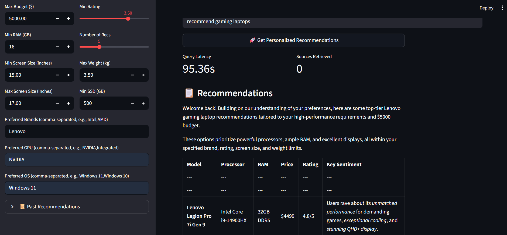

# E-commerce Laptop Recommender RAG

 <!-- Replace with actual screenshot path after upload -->

A powerful AI-powered web application for personalized laptop recommendations using Retrieval-Augmented Generation (RAG). Built with LangChain, Chroma, Gemini, HuggingFace, and Streamlit, it leverages a dataset of 984 laptops to provide tailored suggestions based on user preferences like budget, RAM, GPU, and more, with sentiment analysis for high-quality results.

## 🚀 Features

- **Personalized Recommendations**: Filter laptops by budget, RAM, screen size, GPU, OS, weight, SSD, brand, and rating.
- **Sentiment Analysis**: Prioritizes positive reviews (sentiment score >0.5) using HuggingFace's DistilBERT.
- **Interactive UI**: Streamlit-based app with sliders, inputs, bar charts, and CSV export.
- **Comparison Tool**: Side-by-side specs comparison for selected laptops.
- **History & Adaptation**: Tracks past queries/preferences for a "learning" experience.
- **Efficient Retrieval**: Chroma vector store with sentence-transformer embeddings for fast, relevant searches.
- **Visual Insights**: Price/RAM distribution charts for recommended laptops.

## 🛠️ Tech Stack

- **Backend**: Python, LangChain, ChromaDB, HuggingFace Transformers
- **LLM**: Google Gemini 2.5 Flash
- **Embeddings**: sentence-transformers/all-MiniLM-L6-v2
- **Frontend**: Streamlit
- **Data**: Scraped dataset of 984 laptops (CSV format)
- **Dependencies**: See `requirements.txt`

## 📂 Project Structure

```
ecommerce-laptop-rag/
├── data/
│   ├── laptops_data.csv      # Raw dataset
│   └── chroma_db/           # Chroma vector store
├── scrape_laptops.py        # Scrapes laptop data to CSV
├── chunk_and_embed.py       # Chunks data and builds vector store
├── basic_rag.py             # Basic RAG pipeline
├── sentiment_rag.py         # Adds sentiment analysis
├── personalized_app.py      # Streamlit app with personalization
├── requirements.txt         # Python dependencies
└── README.md                # This file
```

## 🛠️ Installation

1. **Clone the Repository**:
   ```bash
   git clone https://github.com/<your-username>/ecommerce-laptop-rag.git
   cd ecommerce-laptop-rag
   ```

2. **Set Up Virtual Environment**:
   ```bash
   python -m venv venv
   source venv/bin/activate  # Linux/Mac
   .\venv\Scripts\activate   # Windows
   ```

3. **Install Dependencies**:
   ```bash
   pip install -r requirements.txt
   ```

4. **Set Environment Variables**:
   Create a `.env` file in the root directory:
   ```
   GOOGLE_API_KEY=your_gemini_api_key
   ```

5. **Download Dataset**:
   - Place `laptops_data.csv` in `data/` (or run `scrape_laptops.py` to scrape).
   - Expected columns: `name`, `Price`, `RAM`, `Processor Name`, `Processor Brand`, `user rating`, `Screen Size`, `Graphic Processor`, `Operating System`, `Weight`, `SSD Capacity`.

## 🚀 Usage

1. **Build Vector Store**:
   ```bash
   python chunk_and_embed.py
   ```
   - Chunks `laptops_data.csv` and creates `data/chroma_db`.

2. **Add Sentiment Scores**:
   ```bash
   python sentiment_rag.py
   ```
   - Adds sentiment scores to vector store (one-time).

3. **Run Streamlit App**:
   ```bash
   streamlit run personalized_app.py
   ```
   - Opens at `http://localhost:8501`.
   - Set preferences (budget, RAM, etc.), enter a query (e.g., "recommend gaming laptops"), and view results with charts/export.

4. **Test Queries**:
   - "recommend gaming laptops (Budget: $1500, Min RAM: 16GB, GPU: NVIDIA)"
   - "compare thin laptops with 32GB RAM"

## 📈 Example Output

**Query**: `recommend gaming laptops (Budget: $1500, Min RAM: 16GB, Min Rating: 4.0)`

**Recommendations**:
| Laptop | Processor | RAM | Price | Rating | Sentiment |
|--------|-----------|-----|-------|--------|-----------|
| Lenovo Legion 5 | Ryzen 7 5800H | 16GB | $1299 | 4.5 | 0.92 |
| ASUS ROG Strix | Intel i7-11800H | 16GB | $1399 | 4.3 | 0.89 |

**Charts**: Price/RAM bar charts for visual comparison.

**Comparison Tool**: Select two laptops to see side-by-side specs.

## 🛠️ Troubleshooting

- **No Matches**: Relax filters (e.g., budget=$2000, RAM=16GB) or check metadata keys via:
  ```bash
  python -c "from langchain_chroma import Chroma; print(Chroma(persist_directory='data/chroma_db').get()['metadatas'][0])"
  ```
- **Timeout Errors**: Run `streamlit cache clear` or download embeddings offline:
  ```bash
  python -c "from sentence_transformers import SentenceTransformer; SentenceTransformer('all-MiniLM-L6-v2')"
  ```
- **Gemini Quota**: If 429/404, wait or use local LLM (e.g., LLaMA).

## 🌟 Future Enhancements

- **Advanced Comparison**: Multi-laptop diffs with weighted scoring (Step 7).
- **Local LLM**: Replace Gemini with offline model for faster queries.
- **Real-time Scraping**: Dynamic data updates from e-commerce sites.
- **User Profiles**: Save preferences for returning users.

## 📝 Contributing

1. Fork the repo.
2. Create a branch (`git checkout -b feature/xyz`).
3. Commit changes (`git commit -m "Add xyz"`).
4. Push (`git push origin feature/xyz`).
5. Open a Pull Request.

## 📜 License

MIT License. See `LICENSE` for details.

## 🙌 Acknowledgments

- LangChain, ChromaDB, HuggingFace, Streamlit
- Dataset: 984 laptops (scraped from e-commerce platforms)